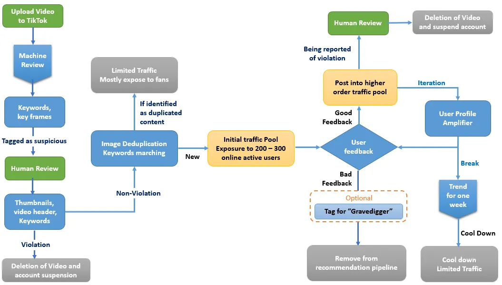

# ML System Design - CS239s by Stanford

## Model offline evaluation
- Simpson's paradox
  - So sliced or fine-grained evaluation is important

- Model calibration
  - Platt scaling

- Model confidence measurement

- Enlarge batch size with limited mem
  - gradient checkpointing
  - gradient accumulation

- Model performance is not the same as business performance

- Out of distribution detection
  - Energy based model

- Types of tests
  - Perturbation test
    - Inject noise to test
  - Invariance test
    - Model output should be invariant to some input changes
  - Directional test
    - Model output should go towards some direction given certain changes in input
  - 

## Distributed Training
- Data parallel
  - Async
    - Parameter server
  - Synced
    - Mirrored
  - Usually could use larger learning rate when effective batch size is larger, because gradient will be more stable and less noisy

- Model parallel

## Framming the probelm smartly
Say if we want to predict what app the user is most likely to open next. There are two approaches
- Method 1
  - Input: User feature, Environment context
  - Output: A vector of N scores where N is number of apps
  - Pro: Only run once for all apps
  - Con: Need to retrain whenever a new app is added/removed!
- Method 2
  - Input: User feature, Environment context, App feature
  - Output: A score for each app
  - Pro: No need to retrain when new app is added/removed
  - Con: Need to run once for each app

## Decoupling the objectives
Say if we are designing a model to feed users with content. We want to make sure the content we feed is both **high quality**(not spam, not misinfo, not hated speach etc) and **high engagement**(user will more likely click it). We have 2 methods
- Method 1
  - Train a model optimize a combined loss, such as $\alpha L_{quality} + \beta L_{engagement}$

- Method 2
  - Train two models separately, on the 2 losses respectively.

We would favor method 2 because
- Its easier to train, optimizing one objective is easier than 2
- Easier to tweak, whenever we want to change $\alpha$ and $\beta$, method 1 requires a retrain, while method 2 does not.
- Easier to maintain. Different objectives might need different maintenance schedules, such as one evolves/changes faster than the other etc.

## OLTP vs OLAP

## Batch Prediction vs. Online Prediction
#### Batch Prediction - Asynchronous Prediction
Model training is actually batch processing. General use cases are video or shopping recommendation system, where you only need to update your recommendation ever hour or so.
#### Online Prediction - Synchronous Prediction
Face ID, speech recognition etc. **Having two different pipelines to process your data for batch (training) and online (deploy) is a common cause for bugs in ML production.** 

## Model on cloud vs model on edge
There are a lot of benefits to run models on edge devices
- Can run without internet
- Lower latency (no internet transaction time)
- Cheaper! The company dont need to pay the cloud comping fee
- More secure for sensitive user data

## Model Compression
Model compression is techniques that makes the model smaller without sacrifice its accuracy, so that it uses less memory and runs faster. Common techniques are
- Low Rank Factorization, such as depth-wise convolution.
- Knowledge Distillation, aka train a smaller network with supervision from a larger network, not used widly in production.
- Prunning. Prunning has two meanings, one is to remove entire nodes of a network, which changes the architechure. The other is set the value of some less significant parameters to 0, which makes the model sparse. Its interesting that there's paper showed that the large sparse model after pruning outperformed the retrained small counterpart.
- Quantization. Need to be careful about the range of the values. And be careful some small values may be rounded to 0. There's also QAT, which allows you to train larger model on the same hardware.

## Model Compiling
Intermediate representation (IR) lie at the core of how compilers work. From the original code for a model, compilers generate a series of high- and low-level intermediate representations before generating the code native to a hardware backend so that it can run on that hardware backend. This process is also called “lowering”, as in you “lower” your high-level framework code into low-level hardware-native code.

## Model Optimization
Once you lowerd your model representation, you could start optimize the model for better performance/efficiency on dedicated hardware. There are two ways to optimize your ML models: locally and globally. Locally is when you optimize an operator or a set of operators of your model. Globally is when you optimize the entire computation graph end-to-end.

Local optimizations:
- vectorization
- parallelization
- loop tiling: leverage the storage pattern to increase cache hit
- operator fusion: remove redudant intermediate memory access

Global optimizations:
- Graph optimization (tensorrt)
  - Vertical fusion
  - Horizontal fusion

Its also possible to use ML to optimize ML

## ML in Browser
Convert to WebAssembly(WASM). Faster than JavaScript but still slow.

## Feature Engineering
### Handle missing value
- Deletion
  - **Row deletion** if small portion of the data entries are missing this value
  - **Column deletion** if a big portion of the data entries are missing this value
- Imputaion
- Scaling
  - Normalization $x'=\frac{x-min(x)}{max(x)-min(x)}$
  - Standardization with scaling $x'=\frac{x-mean(x)}{std(x)}$
  - **Log transform** works well with skewed data distribution

### Discretization
Discretization is bucketing continuous feature into a few categorical buckets. Such as range of salary, range of age. The benefit is instead of learning continuous features, the algorithm only needs to learn to predict on a few categories. To define meanful boundaries, you can try plotting the histograms of the values.

### Encoding Categorical Features
Sometimes there might be infinite many categories, or continuously new categories. For example, new brands on amazon. Some times, even infinite many categories, for example, the user account or email address. How do we deal with this without always retraining our model whenever a new category comes out? There's a very smart but hacky way: **the hashing trick**. Basically we hash the feature, and the hash value will be the category index now. 

One problem with hased functions is collision, but we could enlarge the hash space, or use multiple hash functions to avoid it. And the impact of collision in real world is small. You could also choose locality-sensitive hashing, where similar categories are hased into close by values.

### Feature crossing
Feature crossing can be used to combine multiple (usually 2) categorical features into one. Basically, the space of the new feature is just the cross product of the combined features. It is useful to model non-linear relationships between features for linear models. Deep learning usually dont need this trick. There are some caveats of feature crossing, such as feature space blow up, and overfitting due the the blowed up feature space.

## Data leakage
Data leakage happends when information not availabel during test scenario is injected in training set. Common data leakage sources are preprocessing, future data, etc.

 

## ML system failures
### Causes of ML System Failures
The ML specific failure is harder to detect, it often fails silently.
- operational metrics (software failure)
- ML performance metrics (ML specific failure)

### Edge Cases or Long Tail
Makes ML hard to deploy in safety-critical scenarios, such as self-driving, medical diagnosis, traffic control, eDiscovery, etc.

## Monitoring of ML system failures
### Natual label
Some AI products have natural label, such as click through rate for recommendation system. These will make monitoring easier.

### Feedback loop
The feedback loop is the process between proposing an output and kowing whether the output is correct. Faster feedback loop leads to swifter monitoring. Recommendation systems of clickable ads or next tiktop video etc has a very fast feedback loop. But recommendation for youtube videos, or cloth, or even cars recommendations may take minutes, days, or months to see the real outcome. 

To collect fast feedback for things with long feedback loop, you can have prompts like: “Do you like this recommendation? Yes / No”. And sometiems we could set the feedback window time length, it is a trade-off between speed and a accuracy. Shorter windows will tend to have more premature negative labels.

#### Degenerate feedback loop
Degenerate feedback loop can happen when predictions themselves affects the feedback. For example, in recommendation, things showed at the top are more likely to be clicked by the user, and the system may think these are correct predictions. 

To detect degenerated feedback loop, you could
- Measure the popularity diversity of outputs
- Divide items into polularity buckets, assume accurate recommendation for all buckets. If system recommend polular items much better, then degenerated.

To correct degenerated feedback loop, you could
- Add randomized recommendations and determine how good these random recommendations are. Risk is user may lose interest in random items. There's a method called contextual bandits to fix it.
- When training, add a positional encoding to make the model know the position of item. When inference, remove positional encoding for a fair output.

 

## Data Distribution Shifts
### What is it?
- Train and deploy data distribution may not be same, causing train-serving skew
- Deploy data distribution change
  - Non-stationary real world, such as for 2019, ppl searching for Wuhan want info about travel, for 2020, they may want info about Covid
  - Internal code bugs

### Types of data distribution shifts
Let's call inputs $X$, labels $Y$, training data $(X,Y)$. The ML model usually trys to estimate $P(Y|X)$. The joint distribution of $X, Y$ will be
$$P(X,Y)=P(Y|X)P(X)$$
$$P(X,Y)=P(X|Y)P(Y)$$
- **Covariate Shift**: When $P(X)$ is changed but $P(Y|X)$ remains the same.
- **Label Shift**: When $P(Y)$ is changed but $P(X|Y)$ remains the same.
- **Concept Drift**: When $P(Y|X)$ is changed but $P(X)$ remains the same.

#### Covariate shift
A covariate is a input variable which can influence your interested (output) variable. \
Example 1: Suppose you are learning to predict breast cancer. Your data is collected from hospital, where you have more data from elder female. While in real world, you have female users of all ages. \
Example 2: Suppose you are predicting wheter a coughing is due to covid. Your data is collected from hospital monitoring. However, in real world data are much more dirty than the ideal hospital environment. \
If you know the real world distribution, you could apply importance sampling to mimic real world distribution in training, or inject realistic noise etc. \

#### Label shift
Usually, covariate shift $P(X)$ will also cause label shift, aka $P(Y)$ becomes different. The methods to handle both are similar.

#### Concept drift
In many cases, concept drifts are cyclic or seasonal. For example, rideshare’s prices will fluctuate on weekdays versus weekends, and flight tickets rise during holiday seasons. Companies might have different models to deal with cyclic and seasonal drifts. For example, they might have one model to predict rideshare prices on weekdays and another model for weekends.

### More General Data Distribution Shifts
- **Feature change**: When we have new feature, or old feature become invalid, or the representation of feature is changed.
- **Label schema change**: When possible values of $Y$ changed.

## Handling Data Distribution Shifts

 

## Recommendation system
### Content baded filtering
**profile vector**: stores user's feature, such as type of movie watched \
**item vector**: stores information about products, such as type of the movie \
Content filtering finds the similarity between the two, and recommend ones with highest scores. \
Common similarity methods:
- Cosine similarity
- Euclidean distance
- Pearson’s Correlation

Cons:
- Can only recommend similar items base on user's past behavior, can not recommend items of new tpes.

### User-User Collaborative filtering
Can solve the above con. Collaborative filtering is a method of making automatic predictions (filtering) about the interests of a user by collecting preferences or taste information from many users (collaborating). The underlying assumption of the collaborative filtering approach is that if a person A has the same opinion as a person B on an issue, A is more likely to have B's opinion on a different issue than that of a randomly chosen person.

For example, for a product $i$, the score of it to a user $u$ is
$$P(u,i) = \frac{\sum_v sim(u,v)r(v,i)}{\sum_v sim(u, v)}$$
where $sim(u,v)$ is similarity scores between two users, and $r(v,i)$ is the rating of user $v$ to product $i$. The idea is to weight the rating of similar users higher, different users lower.

### Item-Item collaborative filtering
Similar to User-User, but now we weight the the rating by item-item similarity, and use the user's own ratings. The idea is if the product is similar to other products that the user liked, then the user is also likely to like this product.

$$P(u,i) = \frac{\sum_j sim(i,j)r(u,j)}{\sum_j sim(i, j)}$$

### Cold start
Cold start refers to a new user or new product joins. \
For **user cold start**, just use polulatiry recommendation. For **product cold start**, can first use content filtering.

### Low Rank Matrix Factorization
The intuition behind using matrix factorization is that there must be some latent features (much smaller than the number of users and the number of movies) that determine how a user rates a movie.

### Case study
[Tiktok's recommendation system](https://towardsdatascience.com/why-tiktok-made-its-user-so-obsessive-the-ai-algorithm-that-got-you-hooked-7895bb1ab423)

 

## Active Learning
Instead of randomly selecting samples to train a model on, we use samples most helpful to that model according to some heuristics.