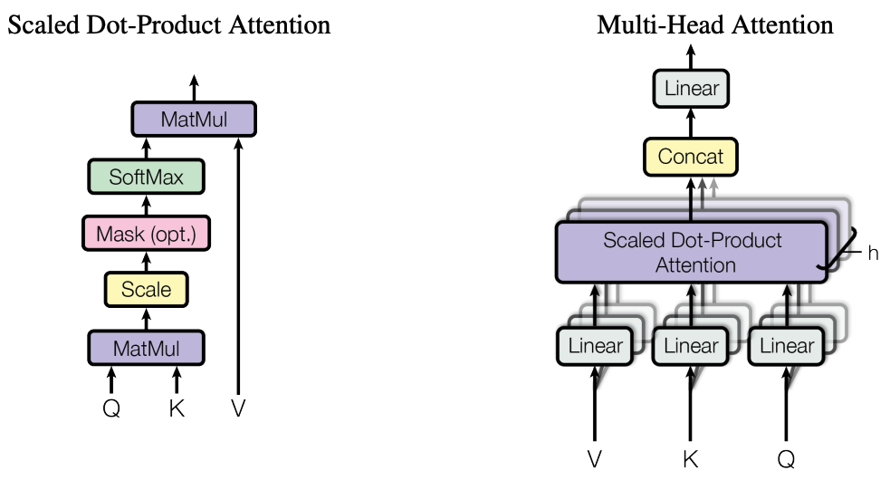
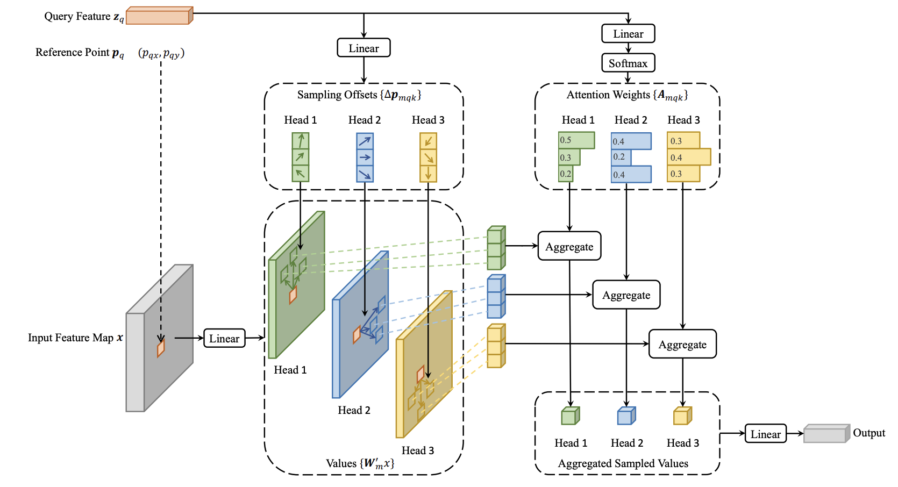
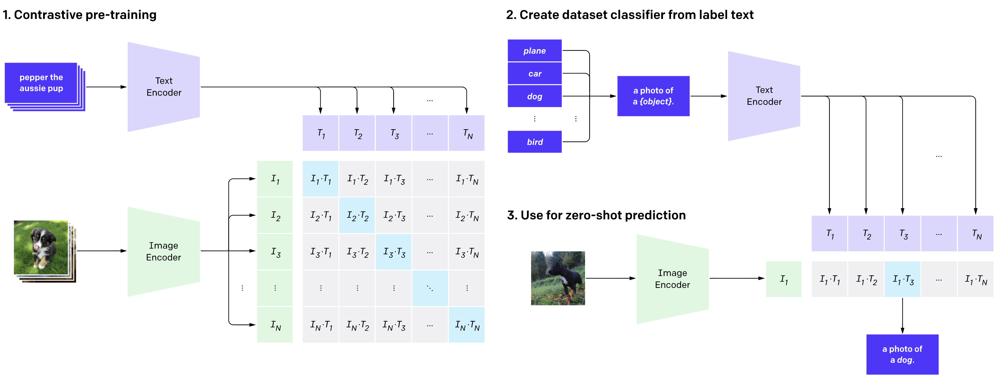

<h1 style="text-align: center;border-bottom: none;">Deep Learning</h1>

# Implement DL modules
Refer to `ml.py`
- TODO: conv2d

# Graph Neural Network

 

# Batch Normalization
Batch normalization is usually over channel. Which means we learn 2 scalars for each channel. This requires us to find mean and std over all pixels acroos the whole batch, for each channel.
$$bn(x)=\gamma \frac{x-\mu}{\sigma + \epsilon} + \beta $$
Helpful for training very depp neural networks. It is helpful in a few ways
- Prevent covariate shift. When lower layers shift the distribution, the uppler layer needs to adjust to it. By Batch Norm, we restrict the shift of the distribution.
- The distribution change of lower layer will counpond. If it shifts too much, it might cause saturation in upper layers, to stop the training earlier. So it could speed up the training.

Why we again add $\gamma,\beta$ to the function? Becasue otherwise we'll restrict the expression power of the model.

We need to also keep a running mean and var during training, in order to use it during testing.

Usually we put batch norm before activation function. But there's no final conclusion on this.

There's also layer normalization (normalizae per input, over all channels and pixels) and instance normalization (normalize per input and per channel). They don't rely on big batch size. And they are more useful for GAN, because each input has its own style, we don't want to normalize it with other inputs.

 

# Regularization
Regularization could be used to prevent overfitting. It is preferred to use a big model with regularization than using a small model without regularization. But why can Regularization prevent overfitting? Because it drives all weights towards zero. A sign of overfitting is some large weights.
## L2 - Ridge regularization - Weight Decay
When performing gradient descent, the actuall effect of L2 regularization is equivalent to multiply the weights with a constant multiplier to shrink the weights, aka weight decay! 
## L1 - Lasso
Instead of multiply the weights with a constant, the effect of L1 regularization is subtracting a constant value that have the same sign as the weight. L1 regularization induces sparsity, so it can be used for feature selection.
## Early stopping
Yeah, it is also a regularization!
## Dropout
Yeah, it is also a regularization! Dropout could also be viewed as a bagging/ensembling. Another interesting view is dropout could also be viewed as a noise that is injected to the model during training.

 

# Attention

$$attention(Q,K,V) = softmax(\frac{QK^T}{\sqrt{d}})V$$

## Scaled dot product attention
The reason for that scale by sqrt dimension d is, as dimension increase, the inner product's value will become larger and larger, the relative difference between large values and small values of the inner product will also be larger and larger. This is bad for learning with softmax because after softmax, the values will be extreme, close to 1 or 0. Then the gradients will be small. So dividing by  a constant can make the values less extreme.

## self vs cross attention
In self attention, K, V, Q are all generated from the same input sequence. In cross attention, K, V are from one sequence, and Q is from another sequence.

## Mulit-head attention
Multi-head attention is trying to mimic conv nets where multiple different features could be learned in paralle.

## Positional enciding
Because attention model does not have information about ordering of the inputs, so positional encoding is important.

## Layer normalizatoin
Attention models usually use layer norm instead of batch norm. One reason is when batching the inputs, each input sequence may not be having the same length. So it does not make sense to normalize across the batch.

 

# Deformable Attention
[Paper](https://arxiv.org/pdf/2010.04159.pdf)

 

# ADAM optimizer
It is a combination of momentum and RMSProp. Momentum is $\alpha G_{t-1} + (1-\alpha) G_t$ which trys to reduce oscillation during gradient descent. RMSProp adjusts the step size/learning rate for each parameter individually. Adam, except for keeping a runnin mean of the gradients with momentum, also keeps a running squared gradient with 2nd degree momentum. And it divides the gradient with the equare root of that ruuning square. This scales small gradients up and big gradients down. Its helpful to get us out from saddle points.

 

# Unsupervised, semi-supervised, self-supervised
## Self-supervised - a type of unsupervised learning
This line of work aims to learn image representations without requiring human-annotated labels and then use those learned representations on some downstream tasks. For example, we can divide the image into pieces and randomly perturb them, let the model to figure out the correct order. Then we use transfer learning to use this learned feature on a different task.
## Semi-supervised Learning
Semi-supervised learning aims to use both labeled and unlabeled data at the same time to improve the performance of a supervised model. An example of this is FixMatch paper where you train your model on labeled images. Then, for your unlabeled images, you apply augmentations to create two images for each unlabeled image. Now, we want to ensure that the model predicts the same label for both the augmentations of the unlabeled images. This can be incorporated into the loss as a cross-entropy loss.
## Unsupervised learning
The goal is to find underlying patterns with each dataset, such as clustering.

 

# ConveNets
## Replace large kernels with smaller kernels
It is also a kind of regularization, because it reduced the number of parameters.
Pros:
- Reduce number of parameter
- Bigger non-linearity

Cons:
- Deeper, so harder to train
## Depthwise convolution
Perform convolutions per channel, then stack the per channel outputs, and apply multiple 1x1 convolutions on the stacked features to form the final output. It reduces the number of parameters significantly.
## ReLU/LeakyReLU vs tanh/sigmoid
- ReLU is usually better for classification, but its decision boundary tends to be piece-wise linear.
- tanh might be better for regression tasks because its smoother nature.

 

# Gradient explosion & Vanishing gradient
Gradient explosion identify: Huge gradients, weights, expecially lower layers, change drastically, weights become NaN, avalanche learning.

Vanishing gradient identify: Small gradients, especially lower layers. Lower layer weights change slowly, model not feel like being trained.

Solutoins:
- proper weight init
- batch norm
- gradient clipping
- use non-saturating activation functions
- use skip connection

 

# Anchorless vs Anchor Based
Anchorless are like CenterNet, ExtremeNet etc. For every pixel, they directly predict a bbox that is relative to the entire image. They don't rely on anchors, so they are less limited to predict huge or tiny objects. We could also potentially avoid NMS with anchorless detectors. Say if we generate GT by using a gaussian to blur a center object pixel, then we could run a 3x3 max pool over the output, then compare the results before and after max pool. The place where value stays the same is a peak and hence an object center. For anchorless, it is tricky to associte pixels to GT if a pixel corresponds to multiple objects.

 

# 2 Stage vs 1 Stage detectors
2 stage detectors, such as faster-RCNN, propose the object proposals first, then classify and refine each proposal. The object proposal network is trained with a regression head and a objectness score head. The classification head, takes roi poooled features, is trained with a multi class classification head and a regression head.

1 stage detectors, such as YOLO, divide the image into a sparse grid (low res feature map) and predicts a set of scores for every pixel. The set of score is NUM_ANCHORS * (4 + num_classes + 1)

 

# How to choose learning rate or multi loss weights?

 

# Data drift detection / model monitoring

 

# Ensemble
Pros:
- reduce variance
- give better accuracy

How to get diff models?
- vary the data
  - hide data
  - random sampling with replacement
- vary the model
  - architechure
  - initialization
- vary the hyper parameter
  - Horizontal epoch
  - Vertical epoch

Ways:
- average / weighted average
- Learned classifier on top of model classifications
- Boosting, but it is complicated
- model weight averaging, average weights of same models

# YOLO v1 - v4
YOLOv1 1 box per grid

YOLOv2 added anchor box and batch norm

YOLOv3 used skip connection hence better backbone, and spatial pynramid prediction - it detects objects on 3 levels of feature maps

YOLOv4 Data augmentation such as mixup, better activation such as mish, better loss such as gIoU

# Why use convolution instead of FC layers?
- Convolution is faster and fewer params
- It leverages and preserves locality property of image feature
- Convolution plus max pooling is translation invariant, which is an important character of image data. But FCN will not be translational invariant.

# What are the steps to prepare data?
- Data cleaning
  - Missing labels
  - Missing features
- Data balancing
- Normalization
- Data transform
- Feature selection
- Dimension reduction

 

# Test time augmentation
Instead of showing the regular, “clean” images, only once to the trained model, we will show it the augmented images several times. We will then average the predictions of each corresponding image and take that as our final guess.

 

# GRU vs LSTM
- GRU performance is on par with LSTMs. But they are simpler, and computationally, it is more efficient.
- GRU also train faster, especially better on less training data.
- LSTM may remember longer sequences than GRUs.

 

# Energy based Model
[Tutorial]((https://uvadlc-notebooks.readthedocs.io/en/latest/tutorial_notebooks/tutorial8/Deep_Energy_Models.html#Energy-Models))

Instead of trying to classifing inputs from space $X$ into output space $Y$, we predict if a certain pair $(x,y)$ fits together or not. For example, $X$ could be an image, and $Y$ could be its class label, or high res version, or style transfered version etc.

We define an energy function:
$$F(x, y) \to R$$

## Inference for classification
Given an input $x$, to use the energy based model for classification, we could simply gather the energy of the model with all possible $y$, and pick the $y$ with largest/smallest energy.

## Gradient based Inference for Generation
When running inference, aka giving $x$, finding $y$, we start with a random $\hat{y}$ and run
$$y=\argmin_y F(x,\hat{y})$$
This assumes a smooth differentiable function $F$ w.r.t. $y$, so that we could start from a random $y$ and slowly converge to a fianl $y$ with gradient descent. It is interesting that in this gradient descent, the model weights are fixed, what is updating is the $y$.

## Contrastive Divergence Training

In general, we could view the energy output as a probability of being an in-distribution example. However, we don't know the cumulative norminator, and it is not guranteed to be a constant during training. So it is hard to have an expected output energy for every training example. However, we could construct negative examples, and let the model to maximize the difference of its outputs between positive and negative examples.

To generate an negative example, we could use the above gradient based inference from random noise.

## Out of distribution detection
A very common and strong application of energy-based models is out-of-distribution detection. You could train an energy-based model along with the classifier, and only output predictions if the energy-based models assign a (unnormalized) probability higher than $\delta$ to the image. You can actually combine classifiers and energy-based objectives in a single model according to this [paper](https://arxiv.org/abs/1912.03263).

# Stable Diffusion Model
This is a very coarse guide of the Stable Diffusion Model! In the simplest form, Stable Diffusion (DALLE2) is a text-to-image model. Give it a text prompt. It will return an image matching the text.
## Diffusion Model
Lets start from the basic diffusion model. The center part of the diffusion model is a noise predictor. And with difussion model, the image is generated unconditioned.
## Forward diffusion
**Forward diffusion** is the process of repeatitively adding noise to an image until it becomes indistinguishable gaussian noise. 
## Reverse diffusion inference

As you can imagine, the **reverse diffusion** is the opposite, it repeatitively removes noise starting from a random image, and gradually makes it look like something. During inference, the noise is predicted by the noise predictor, and the process is done iteratively.
## Training
How the training is done? Easy, we could train the noise predictor that predicts the total noise added till now. More specifically:
1. Pick a training image, like a photo of a cat.
2. Generate a random noise image.
3. Corrupt the training image by adding this noisy image up to a certain number of steps.
4. Teach the noise predictor to tell us how much noise was added. This is done by tuning its weights and showing it the correct answer.

## Stable diffusion and VAE
Now comes the stable diffusion part. The difussion model is slow, because it operates directly on the image space, which is huge. So, here comes **Stable Diffusion -- a latent diffusion model**. 

It first compress the image into a latent space, with VAE. All forward and backward diffusion we talked just now, now happen in this latent space. So during training, it generates random noise in latent space. And corrupts the latent space with the latent noise. The reason for doing that is it is a lot faster since the latent space is smaller.

## Reverse diffusion in latent space
1. A random latent space matrix is generated.
2. The noise predictor estimates the noise of the latent matrix.
3. The estimated noise is then subtracted from the latent matrix.
4. Steps 2 and 3 are repeated up to certain sampling steps.
5. The decoder of VAE converts the latent matrix to the final image.

## Conditioning
Till now, our generative model is unconditioned, we cannot control what's being generated. To tackle this issue, we want to input an embedding to the noise predictor. The embedding could be from a text prompt, class label, or another image, or what ever you want. 

Take text to image as an example, we tokenize the test, generates its embedding, then pass it through a text transformer, then feed it into the noise predictor.

The final picture of reverse diffusion in the latent space is described in the picture below. We repeat this process a few steps, then feed the final latent vector to the VAE decoder, and pass the output through a few fine tunning networks to get the final image.

## CLIP - Contrastive Language-Image Pre-training

For DALLE2 specfically, it uses CLIP (Contrastive Language-Image Pre-training) as the prompt encoder, which learns to associate captions with images. The training of CLIP is as follow
1. First, all images and their associated captions are passed through their respective encoders, mapping all objects into an m-dimensional space.
2. Then, the cosine similarity of each (image, text) pair is computed.
3. The training objective is to simultaneously maximize the cosine similarity between $N$ correct encoded image/caption pairs and minimize the cosine similarity between $N^2 - N$ incorrect encoded image/caption pairs.

 

## Whisper - Speech Recognition
https://openai.com/research/whisper \
Encoder decoder

 

# RLHF - Reinforcement Learning from Human Feedback
