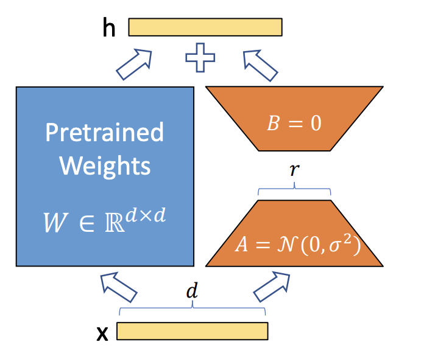
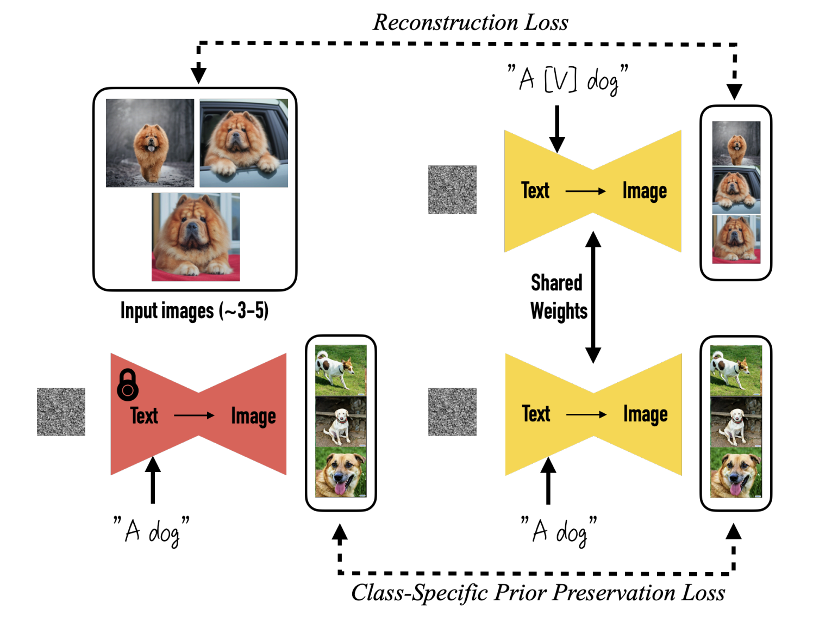
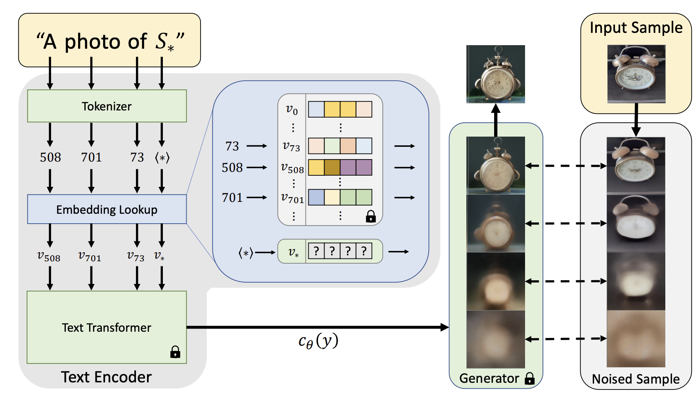

<h1 style="text-align: center;border-bottom: none;"> Interesting Papers </h1>

# [ControlNet](https://github.com/lllyasviel/ControlNet)

It copys the weights of neural network blocks into a "locked" copy and a "trainable" copy.

The "trainable" one learns your condition. The "locked" one preserves your model.

Thanks to this, training with small dataset of image pairs will not destroy the production-ready diffusion models.

The "zero convolution" is 1×1 convolution with both weight and bias initialized as zeros.

Before training, all zero convolutions output zeros, and ControlNet will not cause any distortion.

# LoRA

A novel fine-tunning method that saves a lot of GPU memory and reduces parameter to train by a few orders of magnitude.

Fix the original weight $W$, factor it into 2 matrices $A\times B$, which have much smaller rank than original $W$. Then sum the activation from $W$ and $A\times B$.

Initialize $B$ as zeros so that at the beginning, the new path is no-op.

Training time only train $A,B$.

Inference time can directly set $W_{new} = W + A\times B$.

Learning different $A, B$ on different domains and can switch/combine them with original $W$ to switch between different finetuned models.

# DreamBooth: Finetune for Subject-Driven Generation

Method for few-shot fine-tunning for Text-to-Image model. 

- Designing prompts to contain the meta class, e.g. xxx dog, xxx cat, so that it can leverage the prior knowledge for that class.
- Use a short unique rare-token identifier for the new object, e.g. [V]
- Class-specific Prior Preservation Loss is when fine-tunning for the new object, also inject data that is that general class in order to prevent model from forgetting general meaning of the class.

# Textual Inversion

Learn a new token's embedding by image reconstruction loss.

# Open-Vocabulary Panoptic Segmentation
TODO
